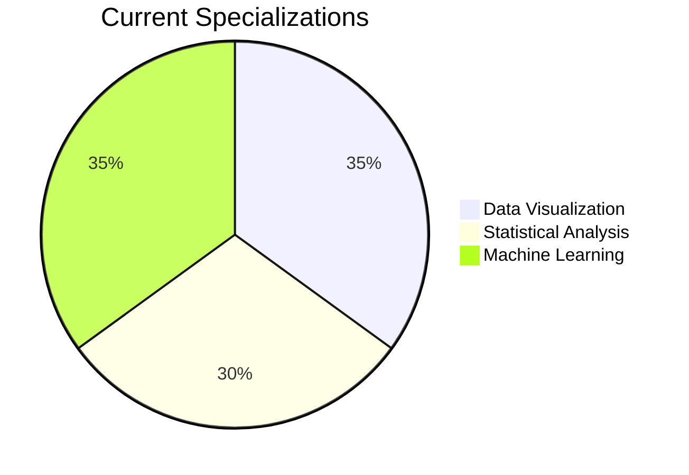

# You're welcome 👋

  

  

  

 

 

## 🎯 **My Data Philosophy**

> *"Numbers have an important story to tell. They rely on you to give them a clear and convincing voice."*

I believe in the power of **data storytelling** - transforming raw numbers into compelling narratives that drive business decisions. With a master's in statistical engineering, I bridge the gap between complex statistical methods and actionable business intelligence.

## 🛠️ **Technical Arsenal**

### 📊 **Core Analytics**

### 📈 **Visualization & BI**

### 🤖 **Advanced Analytics**

## 💡 **What I Excel At**

| **Analytical Approach** | **Business Impact** | **Technical Delivery** |
|------------------------|---------------------|------------------------|
| **Statistical Modeling** | Risk assessment & prediction | Hypothesis testing, regression |
| **Data Visualization** | Clear stakeholder communication | Interactive dashboards, BI reports |
| **Business Intelligence** | Strategic decision support | KPI tracking, performance metrics |
| **Data Pipeline Design** | Efficient data workflows | ETL processes, automation |

 

## 🌟 **Focus Areas**

## 📬 Get in Touch

Have a question or want to collaborate?  
👉 https://razan-altujjar.netlify.app/contact/

💖 Thanks for reaching out — I appreciate your time and interest!

